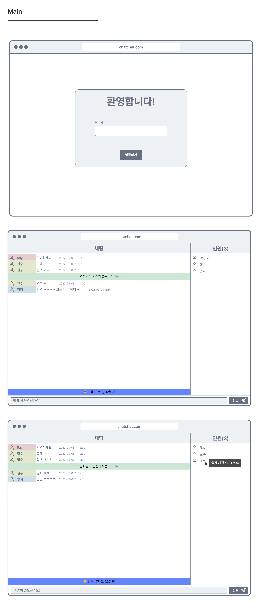

# Chat Chat

## 개요

`Chat Chat`은 간단한 채팅 클라이언트 웹앱이다. 아래의 [와이어 프레임](##디자인-와이어프레임)을 참조하여 동일한 페이지를 만드는 것이 목표이다. 해당 프로젝트는 **js를 이용한 통신, 비동기 프로그래밍, 그리고 컴포넌트 라이브러리를** 활용한 웹앱 구현에 그 목적이 있다. 와이어 프레임을 제공하지만 와이어 프레임을 해치지 않는 선에서 세부적인 구현과 디자인은 구현 과정에서 수정 가능하다.

## 사용 라이브러리 및 프레임워크

- [Nextjs](https://nextjs.org/) - React 앱 개발에 필요한 모든 걸 지원하는 프레임워크
- [TailwindCSS](https://tailwindcss.com/) - 유틸리티 CSS 프레임워크
- [CSS Module](https://github.com/css-modules/css-modules) - CSS에 스코프를 추가해주는 CSS 파일(\*.module.css)

## 참조할만한 사이트

- [Google Fonts](https://fonts.google.com/icons) - 무료 폰트 및 아이콘을 구하기 좋다.

## 프로젝트 시작

### 0. 프로그램 설치

과제를 수행하기 위해 다음 프로그램을 설치한다.

- [node](https://nodejs.org/en/)
- [yarn](https://classic.yarnpkg.com/en/docs/install#windows-stable)

### 1. 프로젝트 구축

#### 1.1. 프로젝트 다운로드 및 초기화

```bash
git clone "https://github.com/Malgn-OJT/chatchat"
cd chatchat
yarn
yarn dev
# ready - started server on 0.0.0.0:3000, url: http://localhost:3000
#웹사이트 실행
```

### 1.2. 패키지 커맨드

각 커맨드의 자세한 사항은 `package.json` 파일을 참조한다. next 자체의 커맨드는 `npx next -h`를 참조하거나 [공식 가이드](https://nextjs.org/docs/api-reference/cli)를 참조한다.

- dev : 개발모드에서 앱을 실행한다. `yarn dev -p 8888` 같은 식으로 포트를 지정할 수도 있다.
- build : 앱을 빌드한다. 빌드한 앱은 최적화가 이루저니 단순한 html/css/js로 `Live Server`에서도 실행할 수 있다. 빌드된 앱은 프로젝트 루트 폴더 밑에 `out` 폴더에 저장된다.
- start : build로 빌드된 앱을 실행한다.
- lint : 코드에 문제가 없는지 검사한다.

#### 1.3. 채팅 서버 연동 인터페이스

[ts-chat-server](https://github.com/walrus811/ts-chat-server) 참조

#### 1.4. 날씨 데이터

[AccuWeather](https://developer.accuweather.com/) 참조


## 디자인 와이어프레임


